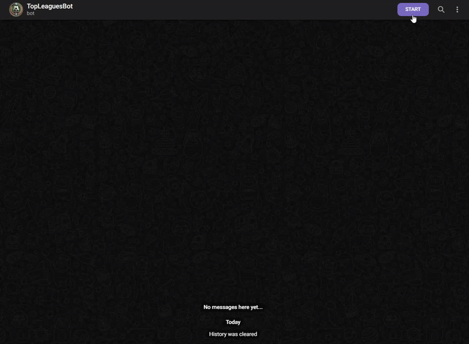
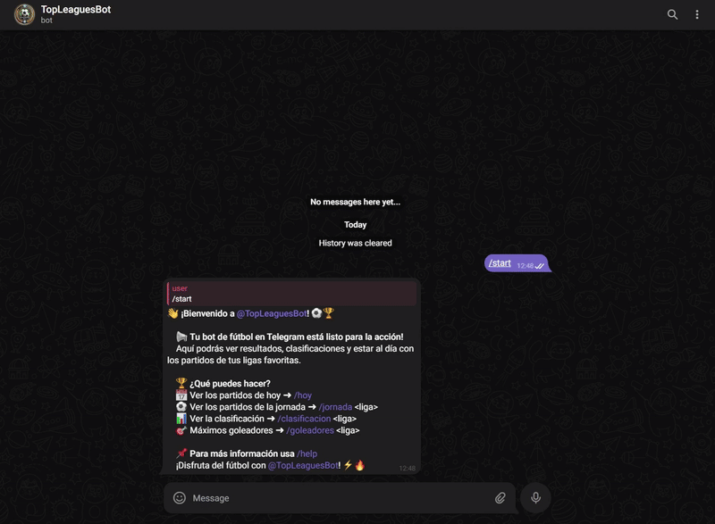
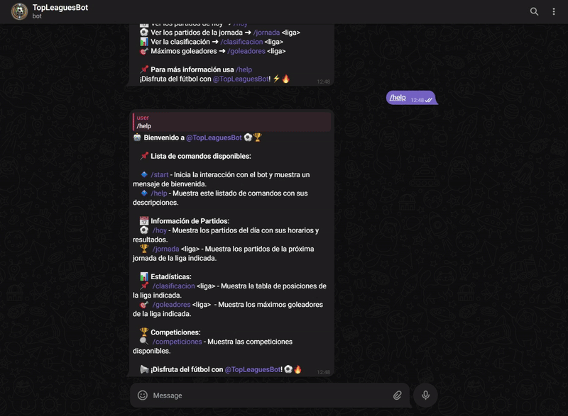
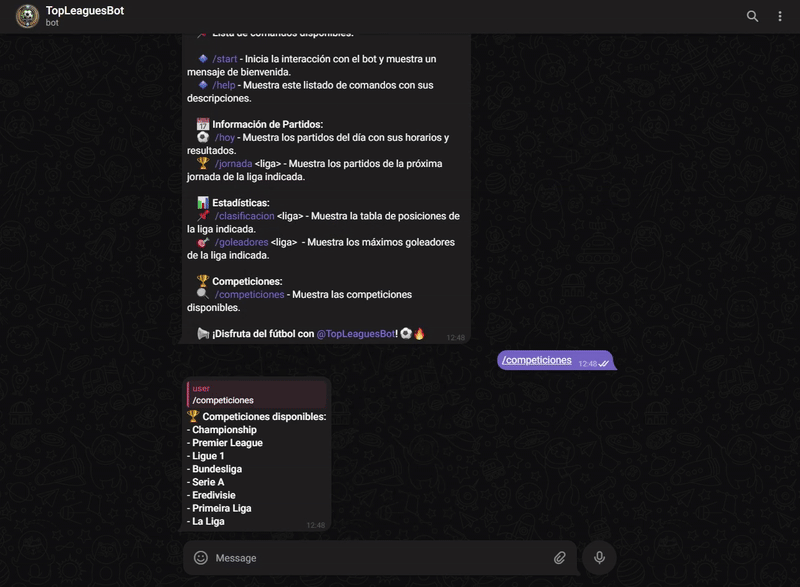
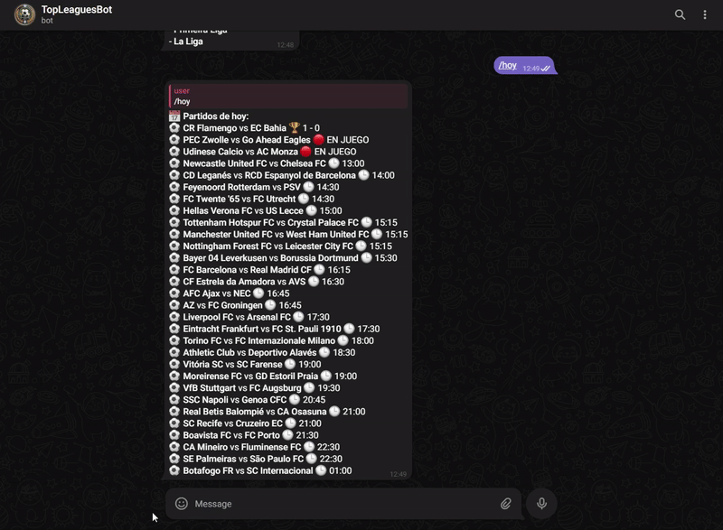
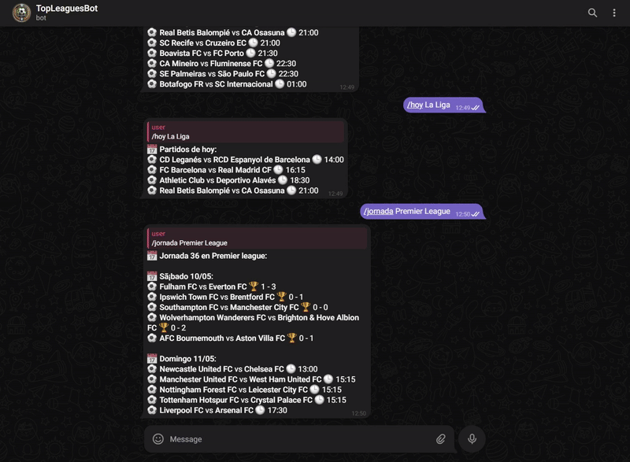
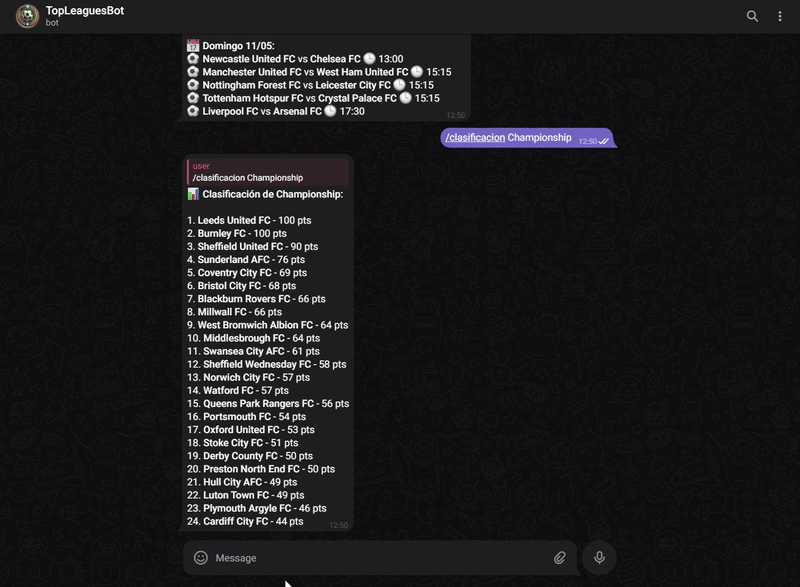

# ⚽💬 TopLeaguesBot

<p align="center">
   <a href="https://github.com/jesuuslopeez/TopLeaguesBot/pulls">
     
   </a>
   <a href="LICENSE" target="_blank">
     
   </a>
   <a href="requeriments.txt" target="_blank">
     
   </a>
</p>

⚽📲TopLeaguesBot is an open-source Telegram bot designed to keep football fans up to date with match results, league standings, and top scorers from the world’s most popular football competitions. Through a simple and conversational interface, it provides fast and reliable access to live football data, helping users stay connected to their favorite teams and leagues in real time. Whether you're tracking recent scores, checking the league table, or reviewing top goal scorers, TopLeaguesBot delivers the essential stats right when you need them — all within Telegram.

> **Important Note:** ⚽📲 _TopLeaguesBot is not intended to replace professional sports analytics platforms or apps._ Instead, it serves as a lightweight, accessible tool for football enthusiasts who want quick updates on top leagues without navigating complex websites or installing dedicated apps. TopLeaguesBot is ideal for casual fans, group chats, or small communities looking to stay informed about scores and standings directly within Telegram.

<p align="center">
    <a href="https://huggingface.co/spaces/davidlms/aphra">How to try it</a>
    ·
    <a href="https://github.com/jesuuslopeez/TopLeaguesBot/issues/new?assignees=&labels=bug&projects=&template=bug_report.md&title=%5BBUG%5D">Report Bug</a>
    ·
    <a href="https://github.com/jesuuslopeez/TopLeaguesBot/issues/new?assignees=&labels=enhancement&projects=&template=feature_request.md&title=%5BREQUEST%5D">Request Feature</a>
    ·
    <a href="https://github.com/jesuuslopeez/TopLeaguesBot/wiki">Wiki</a>
  </p>

## Table of Contents

[The reason behind everything](#the-reason-behind-everything)

[Why TopLeaguesBot and not something else?](#why-topleaguesbot-and-not-something-else)

[How does this work?](#how-does-this-work)

[How to try it](#how-to-try-it)

[Getting Started](#getting-started)

[License](#license)

[Contributing](#contributing)


## The reason behind everything


TopLeaguesBot was born out of a simple but powerful idea: to build something meaningful while exploring new tools and technologies. Initially unsure of what to create —a program, a browser extension, something entirely new— I decided to revisit a familiar concept: building a bot. In the past, I had developed basic Discord bots in JavaScript, mostly reactive and dependent on other bots. This time, I challenged myself to step outside my comfort zone.

I chose to build a Telegram bot using Python, a language I was learning at school at the time. But I didn't just want to create _any_ bot — I wanted it to be about something I genuinely enjoyed. After considering topics like Formula 1, football, and tennis, I chose football. Not only is it a personal passion, but I also found a solid and reliable API that provided real-time data across multiple top leagues.

From there, TopLeaguesBot began to take shape — and it continues to evolve as I learn and improve. It's not just a bot; it's a learning journey turned into a practical tool for football fans

## Why TopLeaguesBot and not something else?

I could make up a deep and moving story about the origin of the name… but not this time.

The truth is much simpler: the API I’m using mostly provides data from top-tier leagues, so the first thing that came to mind was the idea of “TOP.” I thought: _what if I call it the bot for top leagues?_ I tried names like _EliteLeaguesBot_, but they didn’t quite click. Then I landed on _TopLeaguesBot_, and to me, it sounded just right — maybe not the greatest name ever, but it felt perfect.

I ran it by a couple of friends, they liked it, and that was it. If it works for me and it works for them, why overthink it?

## How does this work?


### ⚽💬 **TopLeaguesBot** employs a multi-stage process to provide real-time information about major sports leagues. The bot follows a structured approach to ensure that the user receives up-to-date and accurate data in an easy-to-understand format. Here's how the process unfolds:

#### **1. Analysis**:

The first stage of the process involves the bot analyzing the user's request. When a user interacts with the bot, it processes the query to identify key elements, such as the league or team name, and any specific data points the user is asking for (such as current standings, recent matches, or player statistics). This analysis is crucial for understanding the context of the request, ensuring that the bot responds accurately and relevantly.

#### **2. Search**:

After the analysis, the bot proceeds to gather additional context and information. It connects to external APIs or data sources to fetch real-time data about the league, team, or player in question. This search includes:

-   **Current match results**: Information on ongoing or recent games.
    
-   **League standings**: Updated positions of teams in various competitions.
    
-   **Player statistics**: Performance metrics, goals, assists, and more.
    
-   **Historical data**: For users requesting detailed stats or previous match results.  
    The bot makes sure to gather the most recent and relevant information available to respond to the user’s query.
    

#### **3. Initial Response**:

Simultaneously, the bot generates an initial response using the gathered data. This is a raw, straightforward output that includes the basic requested information. For example, if the user asks about the latest match result of a football team, the bot will quickly provide the score and key statistics. The initial response is designed to be quick and concise, ensuring that users get the information they requested as fast as possible.

#### **4. Review and Refinement**:

Once the initial response is generated, the bot takes a moment to refine the output. It checks if the response is relevant, clear, and properly formatted. This step is essential to ensure that the information makes sense in context and that no critical details are missed. For instance, if a user asked for the standings of a league, the bot ensures the league's name is correctly displayed, and the standings are accurate. It may also adjust the response to improve clarity or provide additional context if needed.

#### **5. Final Response**:

Finally, after reviewing and refining the output, the bot provides a final response. This version is polished and enriched, offering the user a complete, well-structured answer. If the user asked for match results, the response might include a breakdown of key moments, player performances, and any other relevant data that could enhance the answer. The bot ensures the response is not only accurate but also easy to understand, often formatting it in a user-friendly way (e.g., bullet points or brief paragraphs).

This multi-step process allows **TopLeaguesBot** to deliver accurate, real-time, and contextual information to users. By combining fast data retrieval with review and refinement stages, the bot is able to provide responses that are not only precise but also informative and easy to follow. Whether you’re a football fan looking for the latest scores or a basketball enthusiast tracking team rankings, **TopLeaguesBot** is designed to meet the needs of sports fans with real-time, detailed insights.

This structured approach makes **TopLeaguesBot** a valuable tool for sports enthusiasts who need up-to-the-minute information on their favorite leagues and teams, all without the need to sift through multiple sources manually.

## How to try it

Many projects provide a simple demo, but since we have a Telegram bot, it was a bit more complicated... So, I’m going to show you how you can deploy it on your own computer to use it, along with how to use it through screenshots to make it as easy as possible.

Here are some graphical demonstrations of how to use the bot:

### The Start


### Some Help


### The Leagues


### The Matches of the Day 


### The Matches of the Day of a League


### The Matchday


### The Classification


### The Top Socorers


## Getting Started

To get started with TopLeaguesBot, follow these steps:

### Prerequisites

Ensure you have the following installed on your system:
- `git` (for cloning the repository)
- Python 3.8 or higher
- `pip` (Python package installer)
- Docker (optional, for using Docker)

### Clone the Repository

Before proceeding with the configuration or installation, you need to clone the repository. This is a common step required for all installation methods.

1. Clone the repository:
    ```bash
    git clone https://github.com/jesuuslopeez/TopLeaguesBot.git
    ```

2. Navigate into the project directory:
    ```bash
    cd TopLeaguesBot
    ```

### Configuration

1. Get your Telegram Token and Football-Data API:
   - Telegram Token with @BotFather:
	   1. Open Telegram and search for the "BotFather" bot.
	   2. Start a conversation with BotFather and type `/newbot`.
	   3. Follow the instructions to choose a name and username for your bot.
	   4. After creation, BotFather will give you a token, which you can use to interact with the Telegram Bot API.
	
	- Football-Data API:
		1. Visit the [Football-Data.org](https://www.football-data.org/).
		2. Sign up for an account if you haven't already.
		3. Once logged in, go to your dashboard.
		4. In the dashboard, you'll find your personal API key (also known as the access key).
		5. Copy the API key.

2. Go to edit the `config.py` file and:
	- Replace `YOUR_TOKEN` for the token given by BotFather.
	- Replace `YOUR_API_KEY` for the api key token given by [Football-Data.org](https://www.football-data.org/).

3. Finally, go to the `main.py` file and run it. You can then go to Telegram and search for `@TopLeaguesBot` and start your chat with it.

### Installation

1. Install all the requeriments to run the bot:
    ```bash
    pip install -r requirements.txt
    ```

	Yeah, just this, no need to install anything else.

## License

⚽💬 TopLeaguesBot is released under the [MIT License](https://github.com/jesuuslopeez/TopLeaguesBot/blob/main/LICENSE). You are free to use, modify, and distribute the code for both commercial and non-commercial purposes.

## Contributing

Contributions to ⚽💬 TopLeaguesBot are welcome! Whether it's improving the code, enhancing the documentation, or suggesting new features, your input is valuable. Please check out the [CONTRIBUTING.md](https://github.com/jesuuslopeez/TopLeaguesBot/blob/main/CONTRIBUTING.md) file for guidelines on how to get started and make your contributions count.
