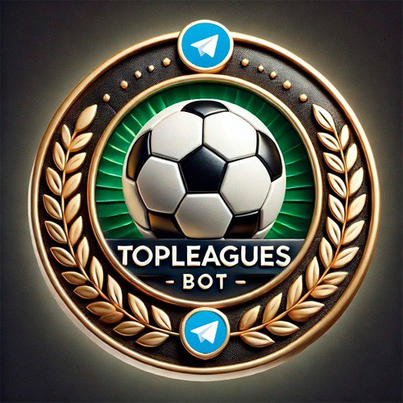
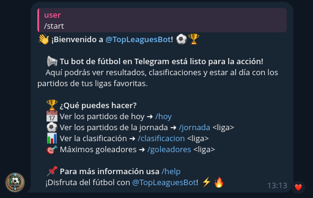
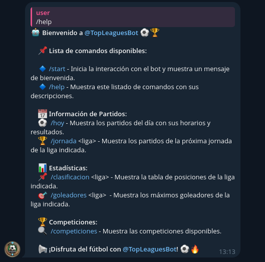
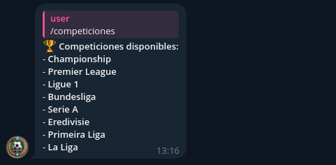
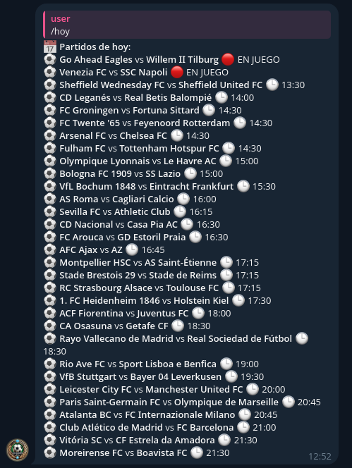
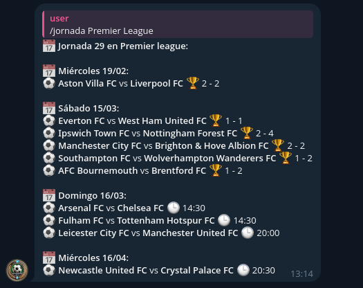
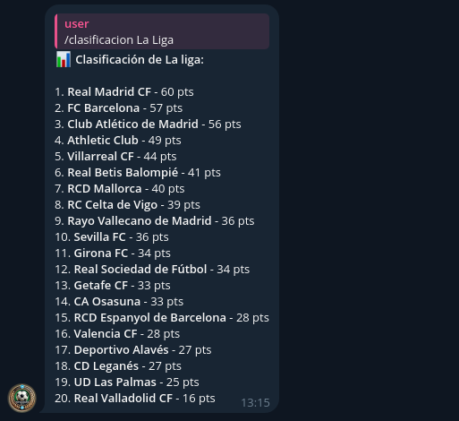
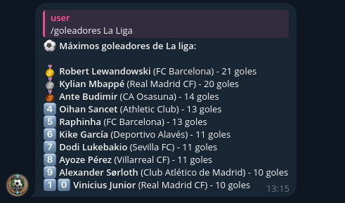

# 📢 TopLeaguesBot - Bot de Telegram ⚽🏆


## 📌 Descripción
Este bot de Telegram proporciona información sobre partidos, clasificaciones y goleadores de las principales ligas de fútbol.

---

## 🚀 Instalación

### 1️⃣ **Instalar Python y pip**
Antes de comenzar, asegúrate de tener **Python 3** y `pip` instalados en tu sistema.

#### 🖥️ Windows:
1. Descarga Python desde la página oficial:  
   👉 [https://www.python.org/downloads/](https://www.python.org/downloads/)
2. Durante la instalación, **marca la casilla**:  
   ✅ `Add Python to PATH`
3. Verifica la instalación abriendo una terminal (`cmd` o `PowerShell`) y ejecutando:
   ```sh
   python --version
   pip --version
   ```

#### 🐧 Linux (Debian/Ubuntu):
Ejecuta en la terminal:
```sh
sudo apt update && sudo apt install python3 python3-pip -y
```
Verifica la instalación con:
```sh
python3 --version
pip3 --version
```

---

### 2️⃣ **Descargar los archivos**
1. Descarga el código fuente en formato ZIP desde el repositorio.
2. Extrae los archivos en una carpeta de tu elección.

---

### 3️⃣ **Instalar dependencias**
Dentro de la carpeta del bot, ejecuta:
```sh
pip install -r requirements.txt
```
Si no funciona, prueba:
```sh
pip3 install -r requirements.txt
```

---

## 🎯 **Cómo ejecutar el bot**
Ejecuta el siguiente comando en la terminal:
```sh
python main.py
```
Si no funciona, prueba:
```sh
python3 main.py
```

---

## 🛠 **Configuración**
- Edita el archivo `config.py` y coloca el **TOKEN de Telegram** y la **API Key de Football Data**.

```python
TOKEN = "TU_TOKEN_AQUI"
FDO_API_KEY = "TU_API_KEY_AQUI"
```

---

## 📢 **Comandos del Bot**
El bot responde a los siguientes comandos:

| Comando                 | Descripción                                            |
|-------------------------|--------------------------------------------------------|
| `/start`                | Inicia la interacción con el bot                       |
| `/help`                 | Muestra los comandos disponibles                       |
| `/competiciones`        | Muestra las competiciones disponibles                  |
| `/hoy`                  | Muestra los partidos de hoy                            |
| `/hoy <partido>`        | Muestra los partidos de hoy de la liga indicada        |
| `/jornada <liga>`       | Muestra los partidos de la jornada en la liga indicada |
| `/clasificacion <liga>` | Muestra la tabla de posiciones de la liga              |
| `/goleadores <liga>`    | Muestra los máximos goleadores de la liga              |

---

## 🖼️ **Demostraciones del Bot**
Así responde el bot a los siguientes comandos:

### `/start`:

### `/help`:

### `/competiciones`:

### `/hoy`:

### `/hoy <partido>`:

### `/jornada <liga>`:

### `/clasificacion <liga>`:

### `/goleadores <liga>`:


---

## 📌 **Autor**
Este bot ha sido desarrollado por [Jesús López](https://github.com/jesuuslopeez).

Si tienes dudas, ¡abre un issue en GitHub! 🚀

